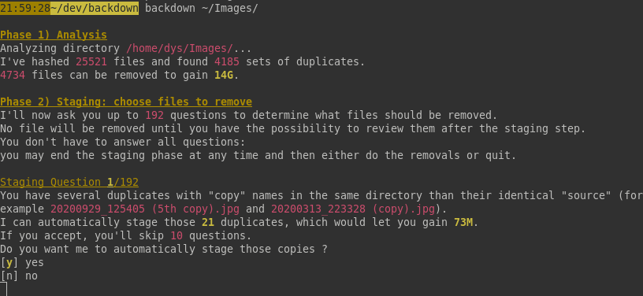
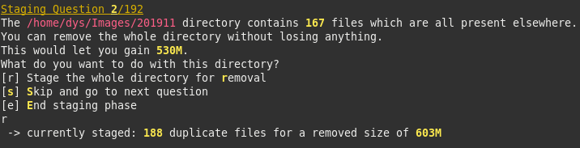
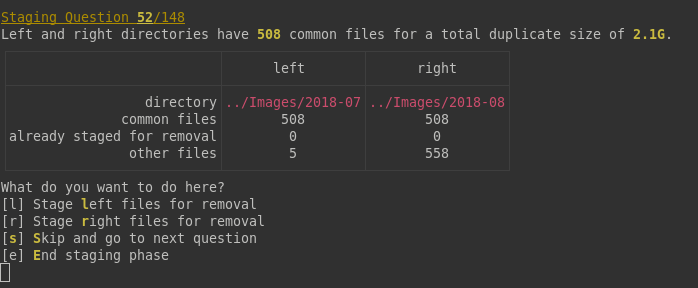
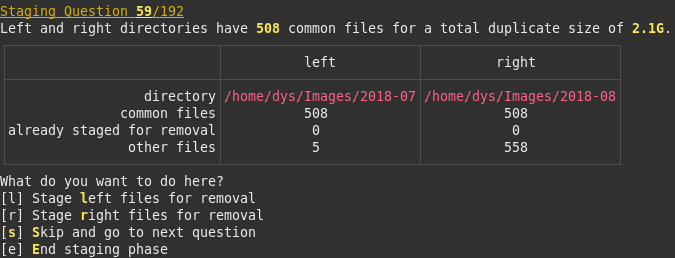
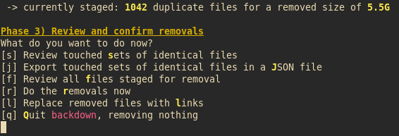

**Backdown** helps you safely and ergonomically remove duplicate files.

Its design is based upon my observation of frequent patterns regarding buil-up of duplicates, espacially images, with time.

A Backdown session goes through the following phases:

1. Backdown analyzes the directory of your choice and find sets of duplicates (files whose content is exactly the same). Backdown ignores symlinks and files or directories whose name starts with a dot.
2. Backdown asks you a few questions depending on the analysis. Nothing is removed at this point: you only stage files for removal. Backdown never lets you stage all items in a set of identical files
3. After having maybe looked at the list of staged files, you confirm the removals
4. Backdown does the removals on disk

# What it looks like

Analysis and first question:



Another kind of question:



Yet another one:



Yet another one:



Review and Confirm:



# Installation

## From the crates.io repository

You must have the Rust env installed: https://rustup.rs

Run

```bash
cargo install backdown
```

## From Source

You must have the Rust env installed: https://rustup.rs

Download this repository then run

```bash
cargo install --path .
```

## Precompiled binaries

Unless you're a Rust developper, I recommend you just download the precompiled binaries, as this will save a lot of space on your disk.

Binaries are made available at https://dystroy.org/backdown/download/

# Usage

## Deduplicate any kind of files

```bash
backdown /some/directory
```

## Deduplicate images

```bash
backdown -i /some/directory
```

# Advices

* If you launch backdown on a big directory, it may find more duplicates you suspect there are. Don't force yourself to answer *all* questions at first: if you stage the removals of the first dozen questions you'll gain already a lot and you may do the other ones another day
* Don't launch backdown at the root of your disk because you don't want to try and deal with duplicates in system resources, programs, build artefacts, etc. Launch backdown where you store your images, or your videos or musics
* Backdown isn't designed for source code and doesn't respect .gitignore rules
* If you launch backdown in a directory with millions files on a slow disk, you'll have to wait a long time while the content is hashed. Try with a smaller directory first if you have an HDD
* If you're only interested in images, use the -i option
