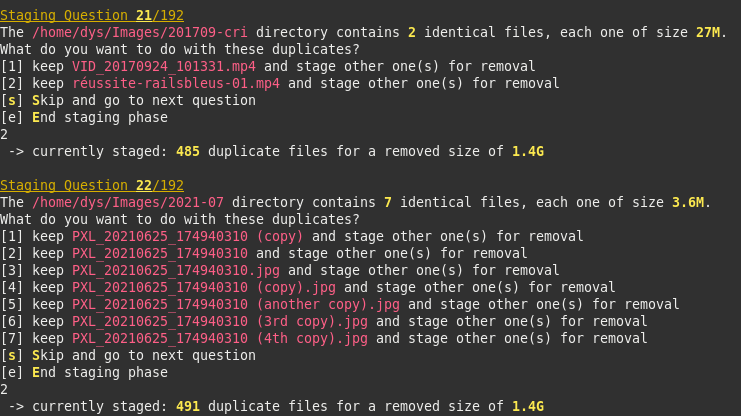

**Backdown** helps you safely and ergonomically remove duplicate files.

A Backdown session goes through the following phases:

1. Backdown analyzes the directory of your choice and find sets of duplicates (files whose content is exactly the same). Backdown ignores symlinks and files or directories whose name starts with a dot.
2. Backdown asks you a few question depending on the analysis. Nothing is removed at this point: you only stage files for removal. Backdown never lets you stage all items in a set of identical files
3. After having maybe looked at the list of staged files, you confirm the removals
4. Backdown does the removals on disk

# What it looks like

Analysis and first question:


Another kind of question:


Yet another one:



Review and Confirm:


# Installation

## From the crates.io repository

You must have the Rust env installed: https://rustup.rs

Run `cargo install backdown`

## From Source

You must have the Rust env installed: https://rustup.rs

Download this repository then run

`cargo install .`

## Precompiled binaries

Unless you're a Rust developper, I recommend to just download the precompiled binaries, as this will save a lot of space on your disk.

Binaries are made available at https://dystroy.org/backdown/download/

# Usage

## Deduplicate any kind of files

```bash
backdown /some/directory
```

## Deduplicate images

```bash
backdown -i /some/directory
```
